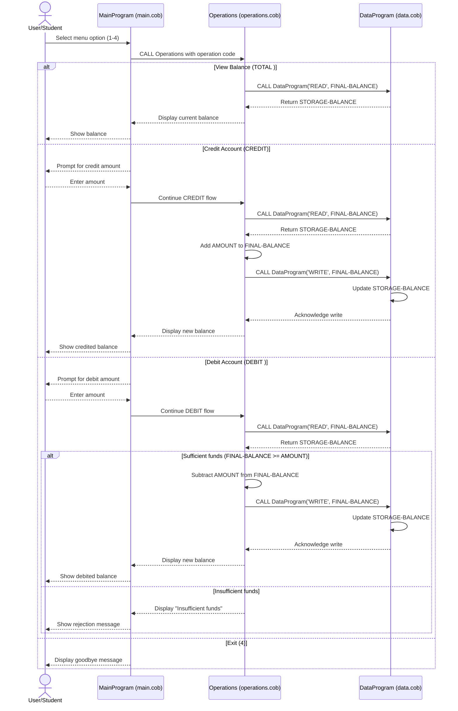

# COBOL Student Account Documentation

This document describes the COBOL programs in `src/cobol/`, their responsibilities, and the business rules used for student account balance management.

## Overview

The system is a simple menu-driven student account manager composed of three COBOL programs:

- `main.cob` (`MainProgram`): user interaction and menu control flow
- `operations.cob` (`Operations`): account transaction logic (view, credit, debit)
- `data.cob` (`DataProgram`): in-memory balance read/write operations

Together, they implement a layered flow:

1. User selects an action in `MainProgram`.
2. `MainProgram` calls `Operations` with an operation code.
3. `Operations` calls `DataProgram` to read/update account balance.

## File Purposes and Key Functions

### `src/cobol/main.cob` (`MainProgram`)

Purpose:
- Provides the interactive console menu for student account operations.
- Routes user choices to the correct business operation.

Key functions:
- Displays menu options:
  - View Balance
  - Credit Account
  - Debit Account
  - Exit
- Accepts numeric user input (`USER-CHOICE`).
- Uses `EVALUATE` to dispatch operations by calling `Operations` with:
  - `TOTAL ` for balance lookup
  - `CREDIT` for adding funds
  - `DEBIT ` for subtracting funds
- Repeats until user selects Exit, then terminates.

### `src/cobol/operations.cob` (`Operations`)

Purpose:
- Executes the core account transaction logic based on operation type.
- Enforces debit validation rules before updating balance.

Key functions:
- Receives operation type through linkage (`PASSED-OPERATION`).
- For `TOTAL `:
  - Calls `DataProgram` with `READ`.
  - Displays current balance.
- For `CREDIT`:
  - Accepts credit amount from user.
  - Reads existing balance.
  - Adds amount to balance.
  - Persists updated balance via `WRITE`.
  - Displays new balance.
- For `DEBIT `:
  - Accepts debit amount from user.
  - Reads existing balance.
  - Checks available funds.
  - If sufficient, subtracts and persists updated balance.
  - If insufficient, displays an error and leaves balance unchanged.

### `src/cobol/data.cob` (`DataProgram`)

Purpose:
- Acts as a lightweight data access layer for account balance state.
- Encapsulates balance read/write behavior.

Key functions:
- Maintains `STORAGE-BALANCE` in working storage.
- Receives command and balance via linkage.
- For `READ`:
  - Copies internal `STORAGE-BALANCE` to caller-provided `BALANCE`.
- For `WRITE`:
  - Updates `STORAGE-BALANCE` from caller-provided `BALANCE`.

## Student Account Business Rules

The following business rules are implemented in the current COBOL programs:

1. Starting balance is initialized to `1000.00`.
2. A student can view current balance at any time through the `TOTAL ` operation.
3. Credit transactions increase the balance by the entered amount.
4. Debit transactions are allowed only when `balance >= debit amount`.
5. If funds are insufficient for a debit, the transaction is rejected and balance does not change.
6. Balance is stored in program memory (working storage), not in a persistent external data store.

## Notes and Constraints

- Operation identifiers are fixed-width strings (`PIC X(6)`), so trailing spaces matter (`TOTAL ` and `DEBIT ` include one trailing space).
- Input validation is minimal:
  - Menu has basic invalid-option handling.
  - Amount fields accept numeric input but do not enforce additional business constraints (for example, non-zero minimums or maximum transaction limits).
- Because storage is in-memory, balance resets when programs restart.

## Sequence Diagram (Data Flow)

